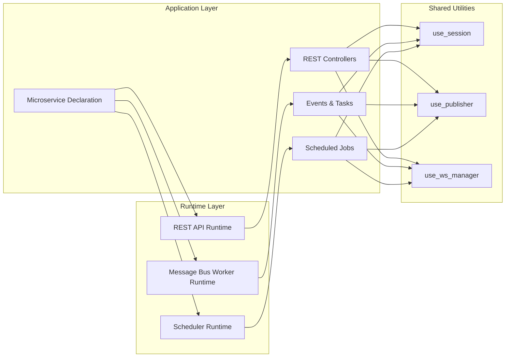

# Jararaca Architecture

## Core Concept: Unified Runtime Interface

Jararaca implements a unified runtime interface that allows different types of applications (REST API, Message Bus Worker, and Scheduler) to share the same utilities and context. This means that utilities like `@use_session` can be used consistently across different runtime contexts, even though they run as separate processes.

## Runtime Types

1. **REST API Runtime**

   - Handles HTTP requests and WebSocket connections
   - Executes REST controllers
   - Uses `@RestController` decorator for route definitions

2. **Message Bus Worker Runtime**

   - Processes asynchronous messages and events
   - Handles tasks and events through `@MessageBusController`
   - Manages message queues and event processing

3. **Scheduler Runtime**
   - Executes scheduled tasks at specified intervals
   - Uses `@ScheduledAction` decorator for task definitions
   - Manages cron-based job execution

## Application Structure

The application structure follows a hierarchical pattern:

1. **Microservice Declaration**

   - Uses `@Microservice` class for configuration
   - Declares providers, controllers, and interceptors
   - No execution happens at declaration time
   - Configuration is shared across all runtimes

2. **Application Implementation**

   - **REST Controllers** (`@RestController`)

     - Handle HTTP endpoints
     - Run in REST API runtime
     - Support middleware and dependency injection

   - **Events and Tasks** (`@MessageBusController`)

     - Handle asynchronous operations
     - Run in Message Bus Worker runtime
     - Support message publishing and consumption

   - **Scheduled Jobs** (`@ScheduledAction`)
     - Execute at specified intervals
     - Run in Scheduler runtime
     - Support cron-based scheduling

## Architecture Diagram



## Key Features

1. **Shared Context**

   - All runtimes share the same context and utilities
   - Consistent access to services like database sessions
   - Unified dependency injection system

2. **Declarative Configuration**

   - Configuration is defined once in `Microservice`
   - Runtime-specific settings are handled separately
   - Easy to maintain and modify

3. **Process Isolation**

   - Each runtime runs as a separate process
   - Clear separation of concerns
   - Independent scaling and deployment

4. **Unified Utilities**
   - Common utilities like `@use_session` work across all runtimes
   - Consistent API for database access, message publishing, etc.
   - Reduced code duplication

## Usage Example

```python
from jararaca import (
    AIOPikaConnectionFactory,
    AIOSQAConfig,
    AIOSqlAlchemySessionInterceptor,
    AppConfigurationInterceptor,
    HttpMicroservice,
    MessageBusPublisherInterceptor,
    Microservice,
    ProviderSpec,
    RedisWebSocketConnectionBackend,
    Token,
    WebSocketInterceptor,
    create_http_server,
)


# Define your application configuration
class AppConfig:
    DATABASE_URL: str
    REDIS_URL: str
    AMQP_URL: str

# Create the microservice with all necessary components
app = Microservice(
    providers=[
        ProviderSpec(
            provide=Token(Redis, "REDIS"),
            use_factory=lambda config: Redis.from_url(config.REDIS_URL, decode_responses=False),
            after_interceptors=True,
        ),
    ],
    controllers=[
        TasksController,  # Your controller class
    ],
    interceptors=[
        # Configuration interceptor
        AppConfigurationInterceptor(
            global_configs=[
                (Token(AppConfig, "APP_CONFIG"), AppConfig),
            ]
        ),
        # Message bus interceptor
        AppFactoryWithAppConfig(
            lambda config: MessageBusPublisherInterceptor(
                connection_factory=AIOPikaConnectionFactory(
                    url=config.AMQP_URL,
                    exchange="jararaca_ex",
                ),
            )
        ),
        # Database session interceptor
        AppFactoryWithAppConfig(
            lambda config: AIOSqlAlchemySessionInterceptor(
                AIOSQAConfig(
                    connection_name="default",
                    url=config.DATABASE_URL,
                )
            )
        ),
        # WebSocket interceptor
        AppFactoryWithAppConfig(
            lambda config: WebSocketInterceptor(
                backend=RedisWebSocketConnectionBackend(
                    send_pubsub_channel="jararaca:websocket:send",
                    broadcast_pubsub_channel="jararaca:websocket:broadcast",
                    conn=Redis.from_url(config.REDIS_URL, decode_responses=False),
                )
            ),
        ),
    ],
)

# Create HTTP server for REST API runtime
http_app = create_http_server(
    HttpMicroservice(
        app=app,
        factory=fastapi_factory,
    )
)


class HelloTask(Message):
    MESSAGE_TYPE = "task"
    MESSAGE_TOPIC = "task.topic.name"

    message: str

# Example controller showing unified utilities across runtimes
@MessageBusController()
@RestController("/tasks")
class TasksController:
    def __init__(self, redis: Annotated[Redis, Token(Redis, "REDIS")]):
        self.redis = redis
        self.tasks_crud = CRUDOperations(TaskEntity, use_session)

    @Post("/")
    async def create_task(self, task: CreateTaskSchema) -> Identifiable[TaskSchema]:
        # Use session in REST context
        task_entity = await self.tasks_crud.create(task)
        await use_ws_manager().broadcast(b"New Task Created")
        await use_publisher().publish(task_entity.to_identifiable(TaskSchema), topic="task")
        return task_entity.to_identifiable(TaskSchema)

    @MessageHandler(HelloTask)
    async def process_task(self, message: MessageOf[HelloTask]) -> None:
        # Use session in Message Bus context
        print(message.message)

    @ScheduledAction("* * * * * */5")
    async def scheduled_task(self) -> None:
        # Use session in Scheduler context
        pending_tasks = await use_session().execute(select(TaskEntity))
        for task in pending_tasks:
            await use_publisher().publish(task.to_identifiable(TaskSchema), topic="task")
```

## Context Hooks and Interceptors

Jararaca provides a powerful system of context hooks (like `use_session`, `use_publisher`, `use_ws_manager`) that are managed through Python's `ContextVar` system. These hooks are configured separately for each execution context and are provided by interceptors configured in the `Microservice` instance.

> **Important Note on Interceptor Order**
> The order of interceptors in the `Microservice` instance matters significantly. Interceptors are executed in the order they are defined, meaning:
>
> - The first interceptor in the list will set up its context before the subsequent ones
> - This order affects how dependencies between different context hooks are resolved
> - For example, if a database session is needed by a message publisher, the session interceptor should be configured before the publisher interceptor

### How Context Hooks Work

1. **Context Isolation**

   - Each execution (HTTP request, message processing, scheduled job) gets its own isolated context
   - Context hooks provide access to resources specific to that execution
   - Resources are automatically cleaned up when the execution completes

2. **Interceptor-Based Provision**
   - Interceptors are responsible for setting up and managing the context
   - They are configured in the `Microservice` instance
   - Each interceptor handles a specific type of resource

### Example: Database Session Management

```python
# The AIOSqlAlchemySessionInterceptor manages database sessions
class AIOSqlAlchemySessionInterceptor(AppInterceptor):
    def __init__(self, config: AIOSQAConfig):
        self.config = config
        self.engine = create_async_engine(self.config.url)
        self.sessionmaker = async_sessionmaker(self.engine)

    @asynccontextmanager
    async def intercept(self, app_context: AppContext) -> AsyncGenerator[None, None]:
        # Creates a new session for this execution
        async with self.sessionmaker() as session:
            # Provides the session to the context
            with provide_session(self.config.connection_name, session):
                try:
                    yield
                    await session.commit()
                except Exception as e:
                    await session.rollback()
                    raise e
```

### Context Hook Lifecycle

1. **Configuration**

   ```python
   app = Microservice(
       interceptors=[
           AIOSqlAlchemySessionInterceptor(
               AIOSQAConfig(
                   connection_name="default",
                   url=config.DATABASE_URL,
               )
           ),
           # Other interceptors...
       ]
   )
   ```

2. **Execution**

   - When a request/message/job starts, interceptors are activated
   - Each interceptor sets up its context using `ContextVar`
   - The context is available throughout the execution

3. **Cleanup**
   - When execution completes, interceptors clean up resources
   - Context is automatically reset
   - Resources are properly closed/released

### Available Context Hooks

1. **Database Sessions** (`use_session`)

   - Provided by `AIOSqlAlchemySessionInterceptor`
   - Creates isolated database sessions per execution
   - Handles transaction management automatically

2. **Message Publishing** (`use_publisher`)

   - Provided by `MessageBusPublisherInterceptor`
   - Manages message publishing context
   - Ensures proper message delivery

3. **WebSocket Management** (`use_ws_manager`)
   - Provided by `WebSocketInterceptor`
   - Handles WebSocket connections and broadcasting
   - Manages connection state

### Usage in Different Contexts

```python
# In a REST Controller
@RestController("/tasks")
@MessageBusController()
class TasksController:
    @Get("/")
    async def get_tasks(self):
        # Gets a session specific to this HTTP request
        session = use_session()
        return await session.execute(select(TaskEntity))


    @MessageHandler(SomeTask)
    async def process_task(self, message: MessageOf[SomeTask]):
        # Gets a session specific to this message processing
        session = use_session()

    # In a Scheduled Job
    @ScheduledAction("* * * * *")
    async def scheduled_task(self):
        # Gets a session specific to this job execution
        session = use_session()
        await session.execute(select(TaskEntity))
```

This system ensures that:

- Each execution has its own isolated resources
- Resources are properly managed and cleaned up
- The same utilities can be used consistently across different runtime contexts
- Dependencies are properly injected and managed
