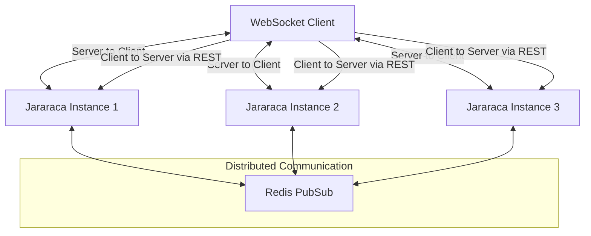
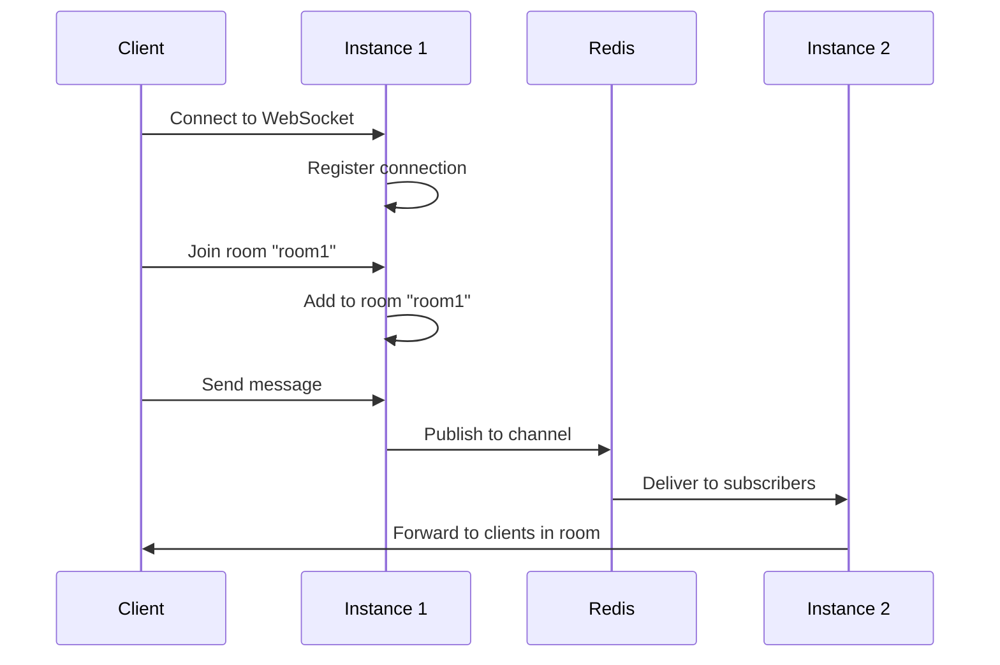

# Distributed WebSocket in Jararaca

Jararaca provides a powerful distributed WebSocket system that enables real-time communication across multiple server instances. This document explains how the WebSocket system works, its architecture, and how to use it in your applications.

## Overview

The WebSocket system in Jararaca is designed for scalability and ease of use, with the following key features:

- **One-way communication pattern**: WebSockets are used for server-to-client messages only, with client-to-server communication happening via REST API
- **Room-based communication**: WebSocket connections can be grouped into logical rooms for targeted messaging
- **Cross-instance messaging**: Messages can be broadcast across multiple server instances
- **Redis-backed distribution**: Uses Redis pub/sub for reliable message distribution
- **Seamless integration**: Works with FastAPI's WebSocket support
- **Type-safe messaging**: Leverages Pydantic for structured WebSocket messages



## Architecture Components

The WebSocket system consists of several key components that work together:

### 1. WebSocketMessageBase

The base class for all WebSocket messages. Messages are structured, validated, and serialized using Pydantic.

```python
class WebSocketMessageBase(BaseModel):
    MESSAGE_ID: ClassVar[str] = "__UNSET__"
```

### 2. WebSocketMessage

A concrete message class that adds functionality for sending messages to specific rooms.

```python
class WebSocketMessage(WebSocketMessageBase):
    async def send(self, *rooms: str) -> None:
        await use_ws_manager().send(list(rooms), self)
```

### 3. WebSocketConnectionManager

A Protocol that defines the interface for managing WebSocket connections:

```python
class WebSocketConnectionManager(Protocol):
    async def broadcast(self, message: bytes) -> None: ...
    async def send(self, rooms: list[str], message: WebSocketMessageBase) -> None: ...
    async def join(self, rooms: list[str], websocket: WebSocket) -> None: ...
    async def add_websocket(self, websocket: WebSocket) -> None: ...
    async def remove_websocket(self, websocket: WebSocket) -> None: ...
```

The WebSocketConnectionManager:
- Maintains a registry of active WebSocket connections
- Groups connections into named rooms
- Provides methods for broadcasting and sending targeted messages

### 4. Context-based WebSocket Access

Jararaca uses context variables to provide access to WebSocket functionality anywhere in your application:

```python
from jararaca.presentation.websocket.context import use_ws_manager, use_ws_message_sender

# Send a message to specific rooms
async def notify_users(message_data: dict, room_id: str):
    message = UserNotificationMessage(**message_data)
    await use_ws_message_sender().send([room_id], message)

# Or directly from a WebSocketMessage instance
async def send_update(update_data: dict, room_id: str):
    message = SystemUpdateMessage(**update_data)
    await message.send(room_id)
```

### 5. RedisWebSocketConnectionBackend

The Redis-based implementation of the WebSocketConnectionBackend:

- Uses Redis pub/sub channels for message distribution
- Enables cross-instance communication
- Handles message serialization and deserialization

### 6. WebSocketInterceptor

The interceptor that integrates everything with the Jararaca framework:

- Manages WebSocket lifecycle
- Provides a connection manager for WebSocket endpoints
- Registers WebSocket routes with FastAPI

## Message Flow

When sending WebSocket messages in a distributed environment, the flow is as follows:



1. **Message Creation**: A `WebSocketMessage` is created and sent to specific rooms
2. **Local Delivery**: The message is delivered to connections in those rooms on the current instance
3. **Redis Publication**: The message is published to Redis channels
4. **Cross-Instance Distribution**: Other instances receive the message from Redis
5. **Remote Delivery**: Other instances deliver the message to their connected clients in the target rooms

## Using the WebSocket System

### Defining WebSocket Messages

Create custom message types by extending the `WebSocketMessage` class:

```python
from jararaca import WebSocketMessage

class ChatMessage(WebSocketMessage):
    MESSAGE_ID = "chat.message"

    user_id: str
    username: str
    content: str
    timestamp: str
```

### Setting Up the WebSocket Interceptor

Configure the WebSocket interceptor in your Jararaca application:

```python
from jararaca import (
    Microservice,
    WebSocketInterceptor,
    RedisWebSocketConnectionBackend,
)
from redis.asyncio import Redis

app = Microservice(
    # ...other configuration...
    interceptors=[
        # ...other interceptors...
        WebSocketInterceptor(
            backend=RedisWebSocketConnectionBackend(
                send_pubsub_channel="jararaca:websocket:send",
                broadcast_pubsub_channel="jararaca:websocket:broadcast",
                conn=Redis.from_url("redis://localhost", decode_responses=False),
            )
        ),
    ],
)
```

### Creating WebSocket Endpoints

Define WebSocket endpoints using the `@WebSocketEndpoint` decorator:

```python
from jararaca import WebSocketEndpoint, RestController, use_ws_manager
from fastapi import WebSocket, APIRouter
from pydantic import BaseModel

# Model for client-to-server REST communication
class ChatMessageRequest(BaseModel):
    content: str

@RestController("/chat")
class ChatController:
    def __init__(self):
        self.router = APIRouter()

    # REST endpoint for client-to-server communication
    @self.router.post("/{room_id}/message")
    async def send_message(self, room_id: str, message: ChatMessageRequest):
        # Process the message from client
        # ...

        # Create and send response via WebSocket to all clients in the room
        ws_message = ChatMessage(
            user_id="123",
            username="user1",
            content=message.content,
            timestamp="2025-04-17T12:34:56Z"
        )

        await ws_message.send(room_id)
        return {"status": "sent"}

    # WebSocket endpoint for server-to-client communication only
    @WebSocketEndpoint("/ws/{room_id}")
    async def chat_endpoint(self, websocket: WebSocket, room_id: str):
        await websocket.accept()

        # Get the WebSocket manager
        ws_manager = use_ws_manager()

        # Add socket to room
        await ws_manager.add_websocket(websocket)
        await ws_manager.join([room_id], websocket)

        try:
            # Keep the connection alive
            # Note: We don't process messages from the client via WebSocket
            # Clients should use the REST endpoints for sending messages
            while True:
                # This only keeps the connection alive
                # Any data received is ignored as client should use REST API
                await websocket.receive()

        except:
            # Handle disconnection
            await ws_manager.remove_websocket(websocket)
```

### Client Implementation Example

Here's how a client might interact with the system:

```javascript
// Client-side JavaScript

// For sending messages TO the server (via REST API)
async function sendMessage(roomId, content) {
  const response = await fetch(`/chat/${roomId}/message`, {
    method: 'POST',
    headers: {
      'Content-Type': 'application/json'
    },
    body: JSON.stringify({ content })
  });
  return response.json();
}

// For receiving messages FROM the server (via WebSocket)
const socket = new WebSocket(`ws://your-server.com/ws/${roomId}`);

socket.onmessage = (event) => {
  const message = JSON.parse(event.data);
  // Handle incoming message from server
  displayMessage(message);
};

// Usage example
document.getElementById('send-button').addEventListener('click', () => {
  const content = document.getElementById('message-input').value;
  sendMessage(roomId, content);
});
```

### Broadcasting Messages

To broadcast a message to all connected clients:

```python
# Create the message
notification = SystemNotification(
    message="System maintenance in 5 minutes",
    severity="warning",
    timestamp="2025-04-17T12:30:00Z"
)

# Broadcast as bytes
ws_manager = use_ws_manager()
await ws_manager.broadcast(
    notification.model_dump_json().encode()
)
```

### Sending to Specific Rooms

To send a message to specific rooms:

```python
# Send directly with the message
await chat_message.send("room1", "room2")

# Or use the manager
await ws_manager.send(["room1", "room2"], chat_message)
```

## Integration with Message Bus

One of Jararaca's powerful features is the ability to seamlessly integrate the WebSocket system with the message bus:

```python
@MessageBusController()
class NotificationController:
    @MessageHandler(UserActivityMessage)
    async def handle_user_activity(self, message: MessageOf[UserActivityMessage]):
        user_data = message.payload()

        # Create a WebSocket message
        notification = ActivityNotification(
            user_id=user_data.user_id,
            action=user_data.action,
            timestamp=user_data.timestamp
        )

        # Send to user's room
        await notification.send(f"user-{user_data.user_id}")
```

This allows background processes to send real-time updates to connected clients, enabling truly reactive applications.

## Under the Hood: Redis Implementation

The `RedisWebSocketConnectionBackend` uses Redis pub/sub channels to distribute messages across multiple Jararaca instances:

1. **Message Publishing**:
   - When sending to rooms, messages are published to the `send_pubsub_channel`
   - When broadcasting, messages are published to the `broadcast_pubsub_channel`
   - Messages are serialized into a specific format for transmission

2. **Message Consumption**:
   - Each instance subscribes to both channels
   - When messages arrive, they're decoded and forwarded to the appropriate WebSocket connections
   - Background tasks handle message consumption and delivery

3. **Room Management**:
   - Each instance maintains its own registry of rooms and connections
   - Messages for specific rooms are only delivered to instances with connections in those rooms

## Best Practices

1. **Message Structure**: Keep WebSocket messages focused and well-structured
2. **Room Naming**: Use consistent naming conventions for rooms (e.g., `user-{user_id}`, `chat-{chat_id}`)
3. **Error Handling**: Always handle WebSocket disconnections properly
4. **Message Validation**: Leverage Pydantic's validation to ensure message integrity
5. **Scaling**: Monitor Redis performance when scaling to many instances or high message volumes

## Conclusion

Jararaca's distributed WebSocket system provides a powerful way to add real-time communication capabilities to your applications. By combining WebSockets with the message bus system, you can build truly reactive applications where events from any part of your system can trigger real-time updates to connected clients.
